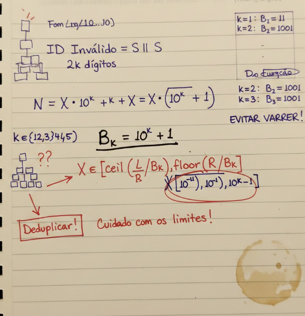

# Eng de software-Matematica-Análise Combinatória e Probabilidade

Projeto em Fortran F90 para resolver o Advent of Code 2025 — Dia 2 (Loja de Presentes).

## Descrição
- Implementa a detecção e soma de IDs inválidos definidos como concatenação de uma sequência decimal repetida duas vezes (`S || S`).
- Foco em eficiência e clareza, com geração direta dos candidatos.

## Pré-requisitos
- Compilador Fortran (recomendado: `gfortran`).
- Windows: instale via MSYS2/MinGW ou pacotes do MinGW-w64.

## Compilar
```powershell
gfortran -std=f95 -Wall -O2 -o aoc_day2.exe main.f90
```

## Executar
```powershell
./aoc_day2.exe
```



## Estrutura
- `main.f90`: ponto de entrada do programa, estrutura inicial e cabeçalho.

## Autor
- Carlos Alberto Dias da S. Filho (`filhotecmail@gmail.com`)

